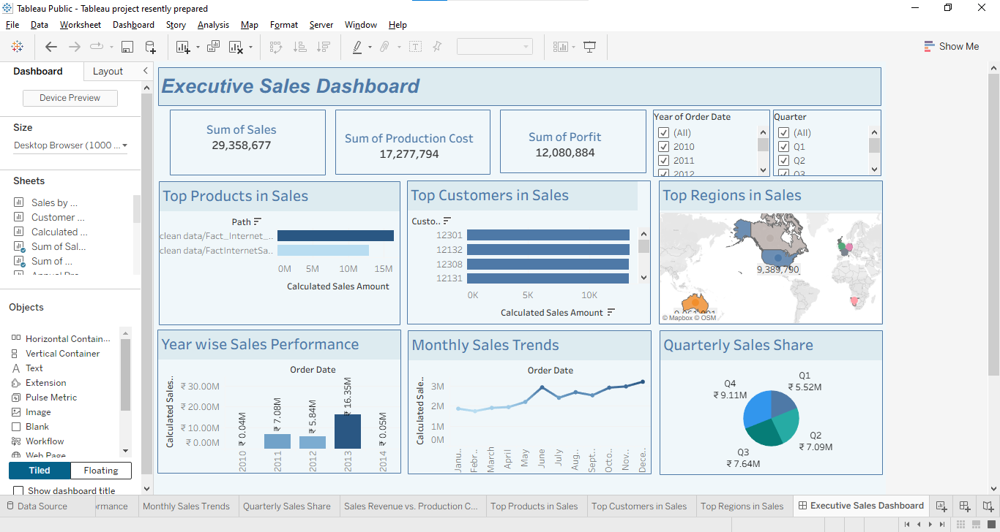

# Executive Sales Dashboard 📊

An interactive Tableau dashboard designed to track, analyze, and present key sales performance indicators, profitability metrics, and regional distributions.

---

## 🖼️ Dashboard Preview

---

## 📈 Dashboard Overview
This executive-facing dashboard provides an end-to-end breakdown of sales figures, production costs, and overall profit margins. It enables stakeholders to quickly monitor fiscal performance across different periods, products, and geographical regions.

### Key Metrics Tracked:
*   **Sum of Sales:** \$29,358,677
*   **Sum of Production Cost:** \$17,277,794
*   **Sum of Profit:** \$12,080,884

---

## 🔍 Visual Components & Insights

### 1. High-Level KPI Cards
*   Provides immediate visibility into total Sales, Production Costs, and Net Profit.

### 2. Performance Breakdown
*   **Top Products & Customers:** Identifies high-value inventory items and driving customer accounts ranked by calculated sales amounts.
*   **Top Regions in Sales:** A geographic map tracking global distribution, highlighting the highest-performing markets (e.g., North America leading with \$9.38M).

### 3. Time-Series Trends
*   **Year-wise Sales Performance:** Side-by-side annual sales comparisons highlighting growth trajectories.
*   **Monthly Sales Trends:** A seasonal line chart illustrating performance fluctuations across monthly cycles.
*   **Quarterly Sales Share:** A clean breakdown showing proportional distribution across fiscal quarters (Q1–Q4).

---

## 🛠️ Tools & Technologies Used
*   **Tableau Public / Desktop:** Dashboard design, calculated fields, and interactive visualization.
*   **Data Source:** Integrated transactional sales tables (`Fact_InternetSales`).

---

## 📂 Project Structure
*   📁 `Executive_Sales_Dashboard.twbx` — The complete Tableau packaged workbook file containing worksheets and data extracts.
*   📁 `dashboard_preview.png` — Visual screenshot preview of the active dashboard layout.

